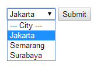
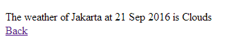

# Panduan

1. Silahkan download dengan klik tombol download di sebelah kanan. Kemudian letakkan folder tes ke dalam folder htdocs.
2. Buka browser, dan ketik URL localhost/test atau jika nama folder telah diubah, maka ketik localhost/[nama-folder-anda].
3. Tampilan awal adalah menu dropdown untuk memilih kota. Silahkan pilih dan klik kota yang diinginkan.
  
</img>
4. Klik Submit, maka akan keluar cuaca (weather) pada kota yang dipilih sebelumnya.
  
</img>
